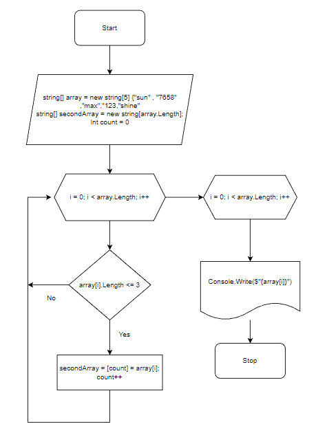

# Итоговая проверочная работа


## **Задача:**

Написать программу, которая из имеющегося массива строк формирует новый массив из строк, длина которых меньше, либо равна 3 символам. Первоначальный массив можно ввести с клавиатуры, либо задать на старте выполнения алгоритма. При решении не рекомендуется пользоваться коллекциями, лучше обойтись исключительно массивами.

**Примеры:**
```
[“Hello”, “2”, “world”, “:-)”] → [“2”, “:-)”]
[“1234”, “1567”, “-2”, “computer science”] → [“-2”]
[“Russia”, “Denmark”, “Kazan”] → []

```
## **Решение**
1. Объявляем два строковых массива, с заданной длинной в начале. Заполняем первый массив случайными символами разной длинны.
2. Задаем метод, цикл которого проверяет каждый набор символов на условие длины , где он <= 3.
3. При выполнении условия, данный набор символов переносится во второй массив.
4. По окончанию проверки вызывается метод, который выводит на консоль набор символов, переложанных во второй массив при вызове первого метода.

### **Блок-схема алгоритма**
>

### **Код программы**
```
string[] array = new string[5] { "sun", "7658", "max", "123", "shine" };
string[] secondArray = new string[array.Length];

void SortArray(string[] array, string[] secondArray)
{
    int count = 0;
    for (int i = 0; i < array.Length; i++)
    {
        if (array[i].Length <= 3)
        {
            secondArray[count] = array[i];
            count++;
        }
    }
}

void PrintArray(string[] array)
{
    Console.Write("[ ");
    for (int i = 0; i < array.Length; i++)
    {
        Console.Write($"{array[i]}");
        if (i < array.Length - 3)
        {
            Console.Write (",");
        } 
    }
    Console.Write(" ]");
}
SortArray(array, secondArray);
Console.Write("Вывод элементов нового массива -> ");
PrintArray(secondArray);
```
### **Вывод в терминал**
```
PS C:\Users\alexd\Desktop\Final_test_work\task> dotnet run
Вывод элементов нового массива -> [ sun,max,123 ]
```